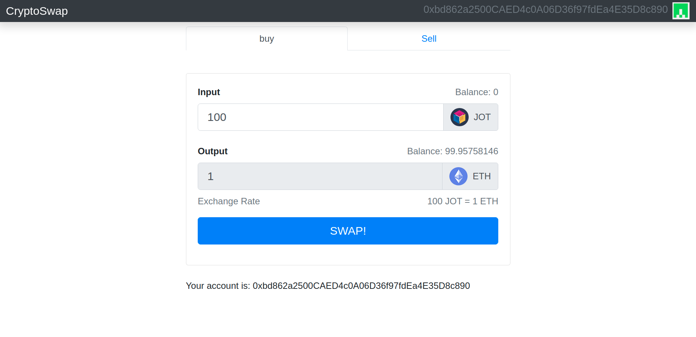

# CryptoSwap - Web 3.0 Blockchain Application

## This project is under development.

### Goal

To create a functional crypto exchange app, using up to date technologies and best practices in the field.

### Features

1. Allow user to buy a JOT token and pay with ETH.
2. Allow user to sell a JOT token and swap it with ETH.

### Built using

For the last few months I have been learning and working on Solidity, so this is what I am using to build this app.

- **ReactJS and Bootstrap**: Front-end
- **Solidity**: Back-end(Smart Contracts)
- **Truffle**: Development environment
- **Ganache**: Test network

## Feedback

Like I just mentioned this project is under development, if you find or see some issues please open one issue and if you need/want a feature you can also make a request for said feature :)

## Running app locally

1. Open a terminal and clone the repo using the following command: `git clone`
2. Install the dependencies using the following command: `npm i`
3. Open Ganache
4. Go into a subdirectory "Truffle" then run the following command: `truffle migrate --compile--all --reset`
5. Go back to the root directory "cd .." and run the following command: `npm start`
